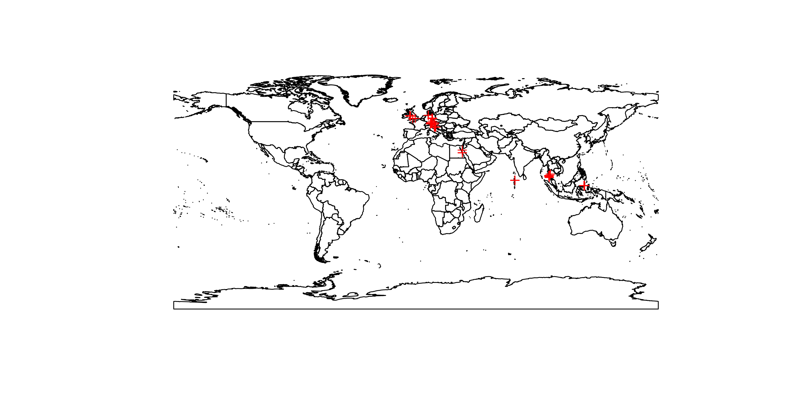

diveLog - A digital scuba diving logbook
================

**Note:** This repository is still very much work in progress\!\!\!

<!--
Dive qualifications:

Dive medicals:
-->

## Read Logbook

``` r
library(XML)

# Load XML data
xmlfile <- xmlParse("data/logbook.xml")
#class(xmlfile)

xmltop <- xmlRoot(xmlfile) #gives content of root
#class(xmltop) #"XMLInternalElementNode" "XMLInternalNode" "XMLAbstractNode"
# print(xmltop)[1]

# To extract the XML-values from the document use xmlSApply
logbook <- xmlSApply(xmltop, function(x) xmlSApply(x, xmlAttrs))

# Get the first element of the first node.
# print(xmltop[[1]][[1]])

# Turn data into data.frame
settings <- lapply(logbook[[1]], function(x) data.frame(t(x)))
settings <- dplyr::bind_rows(settings)

# Get the fifth element of the second node.
# print(xmltop[[2]][[5]])

divesites <- lapply(logbook[[2]], function(x) data.frame(t(x)))
divesites <- dplyr::bind_rows(divesites)

# Get the second element of the third node.
# print(xmltop[[3]][[2]])

dives <- lapply(logbook[[3]], function(x) data.frame(t(x)))
dives <- dplyr::bind_rows(dives)
```

## Dive sites

Total number of dive sites: 171

<!--
Countries where I have been diving: 
Oceans where I have been diving:
Number of dives per dive site:
-->

``` r
data(countriesHigh, package="rworldxtra")

divesites <- tidyr::separate(divesites, gps, into=c("lat", "long"), sep=" ", remove=F)
divesites <- tidyr::drop_na(divesites, c(lat, long))
divesites$long <- as.numeric(divesites$long)
divesites$lat <- as.numeric(divesites$lat)
sp::coordinates(divesites) <- ~long+lat
sp::proj4string(divesites) <- sp::proj4string(countriesHigh)
sp::plot(countriesHigh)
sp::plot(divesites, add=T, col="red")
```

<!-- -->

## Dive logs

<!-- Some durations are wrong -->

``` r
dives$date <- lubridate::as_date(dives$date)
dives$minutes <- sapply(sub(" min", "", dives$duration), function(x) strsplit(x, split="[:]")[[1]][1])
dives$seconds <- sapply(sub(" min", "", dives$duration), function(x) strsplit(x, split="[:]")[[1]][2])
```

Total number of dives: 517  
Date of first dive: 2003-04-20  
Date of last dive: 2019-05-02

<!--
Number of dives in fresh water:
Number of dives in salt water:
-->

<!-- Additional info is still missing ! -->

<!-- 
Deepest depth: -\infty{}
-->

Longest dive: 9

<!--
Temperature range:
SAC rate:
-->
